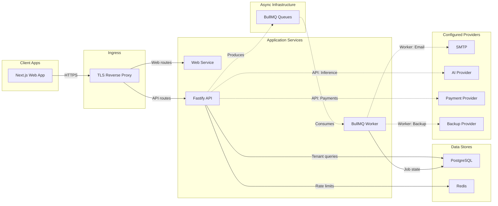

# Architecture

## Decisions

ZeroRoot is a TypeScript monorepo with deployable applications separated from reusable packages. npm workspaces provide a low-complexity dependency graph. Apps own transport and process lifecycle; packages own shared contracts and infrastructure adapters.

The web application is a Next.js server/client application. It consumes reusable accessible primitives from `@zerochack/ui`; data fetching is prepared through TanStack Query, and forms through React Hook Form plus Zod.

The API uses Fastify with a `/v1` boundary. Cross-cutting behavior is registered once: request IDs, security headers, allowlisted CORS, payload limits, rate limiting, structured logs, safe error serialization, and OpenAPI. Business modules will be added under `apps/api/src/modules` and must enforce authorization server-side.

The worker declares eight BullMQ queues and maintains their event connections. Scan, monitoring, backup, notification, email, and report processors are implemented. The `default` and `ai` queues are reserved and have no producers or success-reporting consumers.

AI is centralized behind `@zerochack/ai-gateway`. The API supplies authenticated tenant context; the gateway applies role policy, redaction, layered Redis limits, idempotency, cost controls, and usage accounting; and only a compiled backend adapter can contact a provider. See [Central AI Gateway](AI-GATEWAY.md).

Specialist operations use conditionally updated ticket rows for queue locking and a separate remediation gate joining authorization, verified restore point, temporary session, approved playbook, and post-scan records. See [Specialist remediation](REMEDIATION.md).

## Dependency direction

Applications may depend on packages. Foundation packages must not depend on applications. Provider-neutral packages (`email`, `payments`, `storage`, `ai-gateway`, `reports`, and `notifications`) expose interfaces until providers are selected. `scanner` exposes the `SecurityEngine` interface and contains only the explicitly documented read-only engines.

## Tenant boundary

Every tenant-owned record carries a tenant identifier directly or is reachable only through a tenant-scoped parent. A request receives tenant context only after session validation. Repositories must require that context and include `tenant_id` in every tenant-owned query. Database row-level security is a planned defense-in-depth step after the application role and connection-pooling model are selected; application scoping remains mandatory even with RLS.

## Architecture decision record

- ADR-001: modular monorepo over microservices; boundaries can be extracted after measured need.
- ADR-002: opaque, hashed database sessions over browser-stored bearer tokens.
- ADR-003: PostgreSQL is the system of record; Redis/BullMQ is transient delivery infrastructure.
- ADR-004: provider access uses explicitly configured backend adapters; no provider or credential is enabled by default.
- ADR-005: AI output is non-authoritative and has no mutation tools; security records remain database-authoritative.
- ADR-006: protected remediation fails closed unless authorization, backup verification, session, scope, and resource bindings all agree.

## Deployment view

