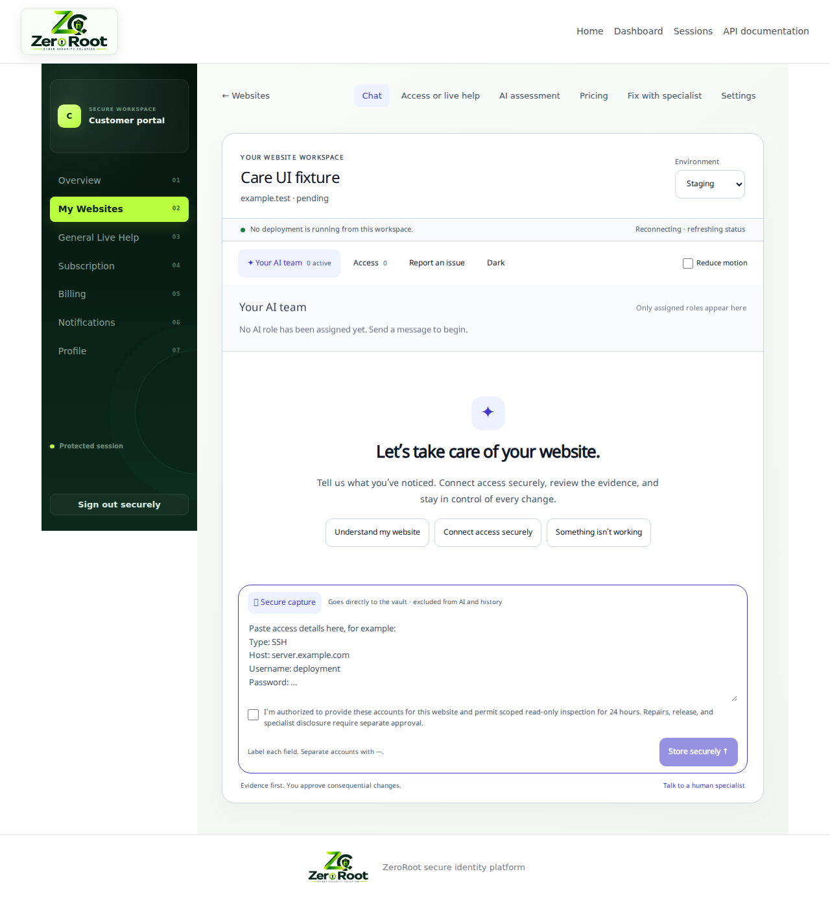
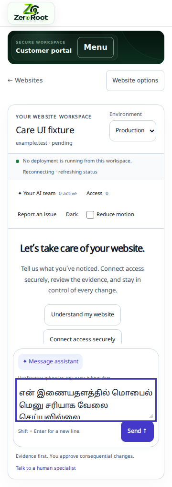

# Chat and secure-access upgrade — implementation record

This branch implements the secure connection and specialist disclosure journey, a chat-first workspace, the Claude adapter, durable activity for actual chat execution, and a bounded standalone HTML repair workflow. **It does not complete the entire 100-item upgrade plan and does not provide general autonomous application repair.** The ledger currently marks 23 narrow acceptance items verified, 69 partially implemented, and 8 without implementation or verification. The item-by-item record is [upgrade-ledger.json](upgrade-ledger.json); the supplied requirements remain in [ZEROROOT-UPGRADE-PLAN.md](ZEROROOT-UPGRADE-PLAN.md).

Baseline: `e82be579fdcca3e6139cc74f74bc0e980ab69dab`. The original unit suite passed 89 tests in 16 files. Existing release-readiness documents are historical evidence; this branch does not convert their outstanding production gates into passes.

## Implemented behavior

The website conversation is the main workspace. It supports safe Markdown, code copying, scoped production/staging history, light/dark appearance, reduced motion, Tamil fonts, mobile menus, IME-safe input, and follow-at-bottom scrolling. Existing website pricing, findings, access, tickets, and settings remain reachable through Website options on small screens. Existing assessment actions navigate back to chat.

Secure capture sends labelled credential blocks or JSON directly to a deterministic parser and an authenticated encrypted vault. It does not call a model or append submitted credential text to chat. Confirmation grants read-only inspection for 24 hours. The receipt distinguishes storage from a successful connection. Duplicate request keys do not create duplicate accounts. Invalid input is discarded with a safe explanation; durable sensitive retries are deliberately not implemented.

Supported storage categories are SSH, SFTP, CMS, database, repository, API, and hosting accounts. This is a **storage-format capability**, not a claim that seven connectors work. Only the existing production SSH connector can consume a new vault reference. It requires a trusted host fingerprint and the existing outbound-address checks. A new credential identity replaces and revokes the old account and its grants. Existing access-form replacement/deletion also revokes linked vault records.

An actively assigned human specialist can request one exact account version for 5–60 minutes with a reason. The customer receives an actionable card from the database. Approval, current assignment, current account version, unexpired authority, enabled MFA, and a session MFA verification within five minutes are checked again by the reveal endpoint. Owner status provides no disclosure bypass. Specialists can now enroll an authenticator in Profile and verify their identity in Approved Access. Revealed values use a separate non-cacheable response, ephemeral component state, and hide after 30 seconds or on window blur. Copies outside the platform require external rotation.

Claude uses the official Anthropic Messages SDK behind the existing gateway. The owner configures the provider key and an available model; no key, model entitlement, or successful live provider connection is invented. Partial tool arguments are assembled and validated before execution. Both adapters bound tool calls, screen tool outputs, and accept cancellation. SDK retries are disabled, and the gateway does not replay tool-bearing requests. Text is buffered until screening completes; browser token streaming is not implemented.

Actual model-backed chat creates persisted A02 Customer Liaison activity. Heartbeats, pause/cancel requests, completion links, and stale execution states come from database records. Authenticated SSE resumes from a sequence cursor and filters tenant, website, and environment. A maintenance task expires credentials/grants, removes expired ciphertext, and marks lost workers stale without replaying work. Customer issues and expected behavior are recorded as scoped repair requests; corrections increment the plan version and invalidate prior approval fields. When CARE_REPAIR_ENABLED is enabled, the supported standalone HTML workflow described below can execute. Unsupported application stacks remain blocked.

## Capability matrix

| Capability | This branch |
| --- | --- |
| Secure conversational storage and revocation | Implemented; opt-in rollout flag |
| Customer-approved named specialist reveal | Implemented with enrollment and fresh MFA |
| Existing production SSH observation connector | Reused through scoped broker references; fingerprint required |
| Other stored account types / staging connectors | Storage only; connection execution unavailable |
| Claude provider | Adapter and contract tests implemented; live smoke test outstanding |
| AI role catalogue | All 24 definitions retained; A02 chat and A08 static HTML repair are implemented |
| Proposed tool catalogue | All 64 entries retained and disabled pending implementation/evaluation |
| Existing assessment tools | Existing scoped tools remain separate from the proposed catalogue |
| Repair execution and source patches | Static HTML data-only runner implemented; disposable execution workers unavailable |
| Attachments | Validated encrypted HTML, screenshots and redacted logs; privacy review required |
| Protected previews and independent verification | Opaque sandbox previews and fixed structural checks implemented; visual/behavior review remains human |
| Exact candidate release | Single-file SFTP service implemented; real-host validation outstanding |
| Cost reservation | Repair model allowance implemented; infrastructure/legacy concurrency accounting remains |
| Knowledge retrieval and inter-agent dependency graph | Not implemented |
| Backup/recovery and production readiness | Existing gates remain outstanding |

## Verification recorded on 23 September 2026

| Check | Result and scope |
| --- | --- |
| `npm test` | 113 passing tests in 20 files, including Anthropic contracts, care policy/vault checks, static candidate validation and SFTP transport contracts |
| `npm run lint` | Passed |
| `npm run typecheck` | Passed across workspaces |
| `npm run build` | API, web, and worker production builds passed |
| Care API integration suite | 22 passing tests using actual authentication/routes and a disposable PGlite PostgreSQL-compatible database; all repository migrations applied |
| Care browser suite | 11 passing API-fixture browser journeys; protected repair previews, exact plan approval, secure intake, responsive widths, environment clearing, Markdown isolation, Tamil input, IME, navigation, themes, and disclosure clearing |
| `npm audit --omit=dev --audit-level=high` | Zero reported vulnerabilities in the checked dependency graph |
| OpenAPI generation | Passed using `node --import tsx apps/api/src/generate-openapi.ts`; generated specification updated |

The browser suite is not a live provider test and does not validate production secrets, DNS, SSH, billing, or deployment. The care integration suite verifies duplicate capture, staging/production history separation, cross-tenant denial, grants, real TOTP enrollment/step-up, reassignment denial, reveal/revocation, legacy replacement, expiry cleanup, stale worker handling, and real authenticated resumable SSE.

The complete integration suite was also attempted through PGlite: 15 tests passed, 4 failed, and 1 was skipped in that earlier run. The four failures included socket/protocol/connection errors after database operations in the PostgreSQL compatibility adapter. **The complete integration suite is not recorded as passing.** It must pass against the real PostgreSQL 16/Redis CI services. Production migration rollback, load, crash/race, accessibility assistive-technology, live provider, and recovery drills remain open. The normal Playwright browser installer could not complete in this workspace; local browser checks used an npm-distributed Chromium binary. The optional `CARE_CHROMIUM_EXECUTABLE` path exists only in the test runner.

## Supported static HTML repair workflow

A customer records the issue, uploads reviewed UTF-8 HTML (up to 200 KB), and approves a versioned plan bound to the source digest, selected model configuration, expected behavior and model allowance. Optional PNG/JPEG screenshots are decoded, resized within limits and re-encoded without metadata; redacted logs are bounded. Screenshots and logs are for human review and are not sent to the model. Upload validation happens before acceptance, with a 200-artifact/50 MB tenant quota and encrypted storage. This is synchronous validation, not a durable asynchronous quarantine service.

The durable worker claims a job with a lease, invokes A08 once through the configured AI gateway, and applies bounded unique-anchor replacements. It never executes uploaded code, scripts, build tools or a shell. Server checks reject dynamic/executable content, external resources and basic structural defects. The candidate is stored encrypted; its raw patch is excluded from chat and AI usage response storage. The approval reserves model cost; known usage settles even when checks fail, while uncertain cost stays reserved. Infrastructure charges and concurrent legacy chat reservations remain outside this accounting.

The authenticated UI displays before/after HTML inside opaque-origin sandboxed iframes with restrictive CSP. Tests verify script blocking, blocked remote image requests, inaccessible frame DOM, mobile width and explicit approval. The customer must review appearance and intended behavior; static checks do not prove visual quality, functionality or full accessibility.

With the separate release flag enabled, a customer selects a fingerprint-pinned production SSH account and a visible absolute path ending in index.html. Fresh MFA and explicit approval bind source/candidate hashes, current plan and account version, target path, public website URL and conditional rollback. The deterministic worker verifies that the remote file and public HTML response exactly match the approved source, saves and decrypt-verifies the original, takes a remote exclusive lock, checks for drift again, and uses the OpenSSH atomic-rename extension. Unsupported atomic overwrite fails closed. Health requires HTTP 200, HTML content type and the exact candidate hash; transformed/minified/cache-modified pages are unsupported.

Failed candidate health triggers the specifically approved conditional restore, only while the remote file still matches the candidate. Uncertain writes become OUTCOME_UNKNOWN, retain recovery material and block another website release. Reconciliation observes remote/public hashes and removes only the matching release lock; it does not replay replacement. The API integration tests use a simulated remote transport and a fixture model adapter through the real gateway. SFTP unit tests cover its callback contract. No real SSH endpoint, provider account, public deployment or disaster-recovery drill was exercised.

## Remaining implementation and external gates

General frameworks, JavaScript applications, multi-file repositories, databases and build systems still need a provisioned disposable execution worker and independent runtime/browser verification. Twenty-two proposed AI roles, the 64 proposed general tool interfaces, coordinator dependencies, reviewed knowledge retrieval, full infrastructure billing, asynchronous attachment quarantine and broader operational controls remain incomplete. No implementation catalogue entry substitutes for these services.

Before enabling production release, run the full integration suite against PostgreSQL 16/Redis, use a real provider account with configured prices, test a disposable SFTP/static-host target and rollback, establish an exclusive deployment window, verify key/backup retention, and complete crash/failover and authorization-expiry drills. A separate external writer can race SFTP; it must be excluded operationally because ordinary SFTP cannot atomically compare and swap against unrelated writers. Neither static checks nor this branch certify production readiness.

See [CARE-OPERATIONS.md](CARE-OPERATIONS.md) for opt-in configuration, retention and recovery procedures.

## Browser fixture captures

These images show the local application with synthetic API fixtures, not a live customer or production connection.

