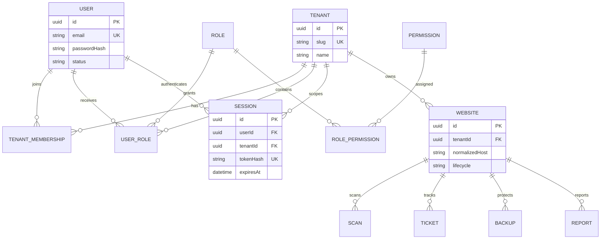

# Database

PostgreSQL 16 is accessed through Prisma. Identifiers are UUIDs; timestamps use timezone-aware precision; relationships have explicit deletion behavior, indexes, and uniqueness constraints.

## Initial schema

- `users`: global identity, unique normalized email, optional password hash.
- `tenants`: organization boundary with unique slug.
- `tenant_memberships`: unique user/tenant association and lifecycle status.
- `roles`: system or tenant-owned role definitions.
- `permissions`: globally unique permission keys.
- `user_roles`: user/role assignments.
- `role_permissions`: normalized role/permission assignments required for RBAC.
- `sessions`: opaque token hashes, user and tenant scope, expiry and revocation.
- `audit_logs`: append-oriented tenant activity with actor, request, resource, network, and JSON metadata.
- `auth_tokens`: hashed, expiring, atomically consumed email, reset, and MFA challenges.
- `mfa_recovery_codes`: one-use hashed Owner recovery codes.
- `agency_client_relationships`: explicit lifecycle-controlled cross-tenant grants.

Users carry verification, approval, suspension/deactivation, lockout, and encrypted MFA state. Sessions include device metadata, last activity, revocation reason, and MFA verification time. `user_roles` is tenant-bound in addition to its role and user references.

Phase 2 tenant resources are `websites`, `website_verifications`, `security_findings`, `scans`, `tickets`, `backups`, `reports`, `chat_messages`, `subscriptions`, `invoices`, and `notifications`. All carry a tenant ID and all API access combines that value with the session tenant. Website deletion is an archive transition so evidence and audit history remain available.

Phase 3 enriches scans with progress and engine state, enriches findings with normalized security taxonomy and lifecycle fields, and adds `finding_evidence`. Composite constraints bind evidence to the same tenant, website, scan, and finding. A partial unique index permits only one queued or running scan per tenant website.

Phase 4 adds `ai_providers`, `ai_credentials`, `ai_models`, `ai_tenant_policies`, and `ai_usage`. Credentials contain AES-GCM ciphertext only. Usage has tenant/user membership, provider/credential/model, idempotency, request, token, latency, status, error, and estimated-cost constraints. Composite foreign keys prevent associating a credential with the wrong provider or an AI response message with another tenant.

Phase 5 expands the ticket state machine and adds `remediation_authorizations`, `remediation_sessions`, `remediation_playbooks`, `remediation_runs`, `warranty_policies`, and `warranty_claims`. Backup records can be ticket-bound and contain restore-reference, integrity, and verification metadata. Composite foreign keys bind authorization, sessions, runs, claims, tickets, websites, and tenants at the database boundary.

Phase 6 adds stable `commercial_packages` with immutable `package_versions`. Subscriptions, invoices, and quotes reference historical versions and preserve terms snapshots. Transactions, refunds, and webhook events are append-oriented provider evidence protected by idempotency constraints. See [Commercial platform](COMMERCIAL.md).

Phase 7 enriches backups and adds backup/monitoring policies, monitoring checks, security events and evidence, deduplicated alerts, restore authorizations and operations, and tenant Developer Mode settings. Composite foreign keys bind tenant-owned operational records to their website. Provider-confirmed deletion is represented by `deleted_at` rather than destroying historical database evidence.

## Migrations

Development creates migrations with `npm run db:migrate`. CI and deployments apply committed migrations with `npm run db:migrate:deploy`. Never use `prisma db push` against a shared or production database.

Production requires separate application and migration database roles, TLS, automated encrypted backups, point-in-time recovery, restore exercises, monitoring, and an explicit retention policy. These are external infrastructure responsibilities and are not claimed by this repository.

## Security and tenancy ERD

Application queries bind tenant-owned records to the tenant derived from the authenticated session. Composite foreign keys protect key tenant-owned chains. PostgreSQL row-level security is not currently enabled; database credentials must therefore be restricted to application services and this remains a defense-in-depth item in the release report.
