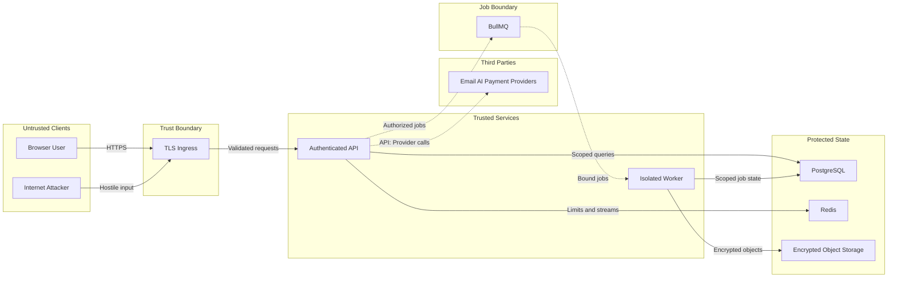

# Threat model

## Scope and assets

Protected assets include account credentials, MFA material, session tokens, tenant security evidence, temporary remediation access, backup ciphertext, AI/provider credentials, payment state, affiliate balances, reports, and audit records.

## Principal threats and controls

| Threat | Primary controls | Residual risk |
|---|---|---|
| Credential theft | Argon2id, HttpOnly Secure SameSite cookies, hashed opaque tokens, Owner TOTP | Endpoint compromise and phishing require operational detection |
| Horizontal access | Session-derived tenant ID, tenant predicates, composite foreign keys, negative integration tests | No PostgreSQL RLS defense in depth |
| Privilege escalation | Server-side permissions, role verification, Owner MFA step-up | RBAC changes require migration review |
| SSRF | Protocol/port allowlist, public-address checks, DNS pinning, per-redirect revalidation, hostname binding | Production egress policy must also be deployed |
| XSS and CSRF | React escaping, CSP, strict cookies, Origin and Fetch Metadata checks | CSP permits inline styles for framework compatibility |
| Queue forgery/replay | Resource bindings reloaded from PostgreSQL, deterministic IDs, state claims | Redis requires TLS, authentication, and network isolation |
| AI leakage/injection | Backend-only credentials, tenant-scoped context, redaction, untrusted-context instructions, quotas | Model behavior is probabilistic; minimize sensitive context |
| Payment forgery | Exact raw-body verification, freshness window, event idempotency and collision checks | Real provider adapter and reconciliation are deployment dependencies |
| Backup disclosure | AES-256-GCM before storage, tenant-bound AAD, integrity verification | No runtime backup source/provider is installed |
| Remediation abuse | Bound authorization, verified backup, scoped temporary token, approved playbooks, expiration and revocation | Real connector/playbook execution is not installed |
| Audit tampering | No mutation API, restricted Owner reads, secret redaction | Database append-only role and immutable external export are not implemented |

## Assumptions

TLS terminates at a trusted proxy; PostgreSQL and Redis are private; production secrets come from a secret manager; workers run with controlled outbound egress; provider webhooks arrive without browser cookies. Deployment review must verify each assumption.
